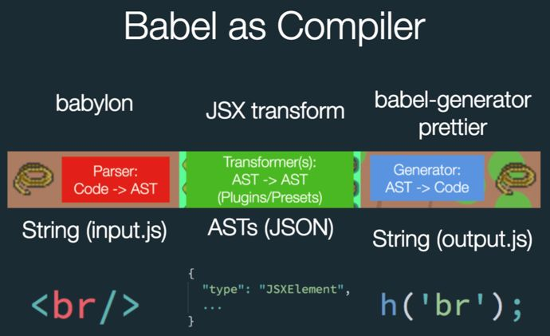

## babel插件

参考视频链接 https://www.bilibili.com/video/BV1X5411n7Lo

### 要安装的包

- `npm i @babel/core -D`

### 测试

- 测试自练文件时 只需要node test.js进行练习即可
- 若在vue项目中进行测试
  - 在项目中使用自定义插件需要借助全局变量和环境变量的帮忙来判断当前是否是生产环境和全局变量DEBUG使用
> 注意：测试vue项目example时，修改babel1自定义插件文件时，直接重新启动是更新不了的，是有缓存记录的，需要babel.config.js和babel1名字重命名一下 就不会走缓存了

### 正文

- 先安装babel插件： `npm i @babel/core =D`, babel插件就是一个函数，拿来执行的
- 借助eslintrc配置文件中可以注入全局变量，为全局注入一个DEBUG全局变量默认为true只读 13分时
  - ***好像eslintrc配置文件中全局变量的设置只是用于eslint插件的编译识别和babel打补丁用，但真正在代码中访问那个全局变量其实是并没有定义的，这点切记***
  - 这个全局变量只是用来eslint检查错误的时候能避开错误提示，并不是真的全局变量
  - 可以通过插件 将预设全局变量编译期间替换为字符串 使得if判断能通过，或替换console标识符里的全局变量为真值使得console能打印出来，否则就是未定义
- test.js文件使用插件时可以传第二个参数options选项，能往插件里注入一些自定义参数如isRemove,然后在自定义插件源码中的2参state能接受到使用者注入的参数

#### babel插件原理

babel原理就3个步骤：解析---转换---生成 对应下图3个阶段。
[文章参考](https://www.jianshu.com/p/b4b93ee8050d)
